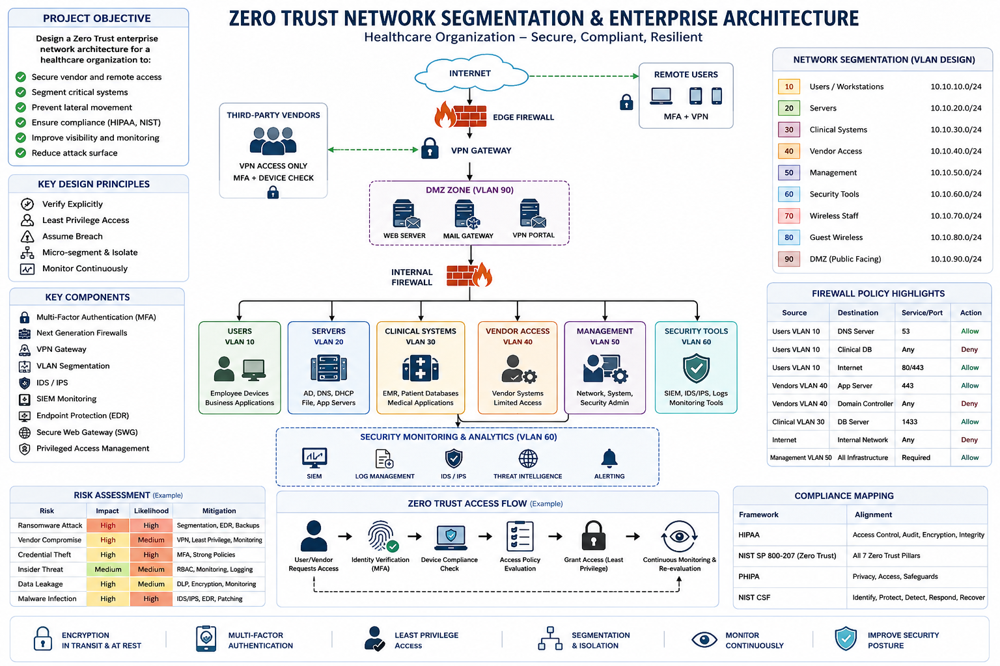
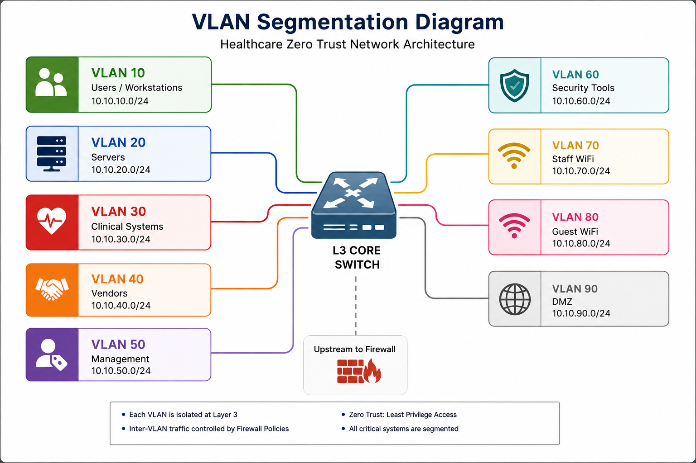
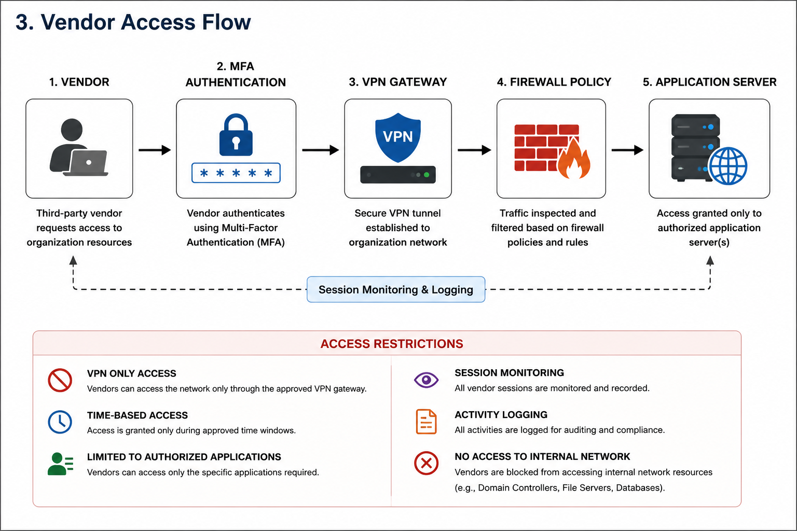
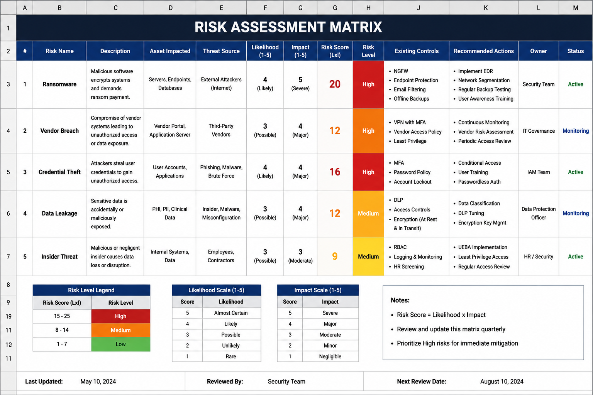
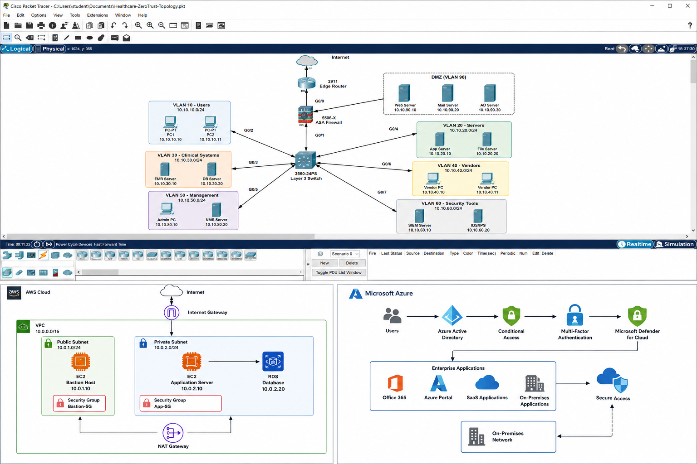

# Zero Trust Network Segmentation & Enterprise Architecture

## Project Overview

This capstone project demonstrates the design of a secure enterprise network architecture using Zero Trust principles for a healthcare organization. The solution secures critical systems, protects sensitive data, restricts vendor access, and improves visibility through network segmentation, firewall controls, MFA, SIEM monitoring, and cloud security integrations.

---

## Enterprise Architecture

---

## VLAN Segmentation Design

---

## Vendor Access Flow

---

## Risk Assessment Matrix

---

## Packet Tracer, AWS and Azure Architecture

---

## Business Objectives

- Protect healthcare systems and patient information
- Secure third party vendor access
- Reduce attack surface
- Improve visibility and monitoring
- Support compliance requirements
- Enable secure remote connectivity

---

## Security Objectives

- Verify every user and device
- Enforce least privilege access
- Prevent lateral movement
- Monitor and log security events
- Segment critical systems
- Improve incident detection capabilities

---

## VLAN Structure

| VLAN | Purpose | Subnet |
|--------|----------|----------|
| 10 | Users | 10.10.10.0/24 |
| 20 | Servers | 10.10.20.0/24 |
| 30 | Clinical Systems | 10.10.30.0/24 |
| 40 | Vendors | 10.10.40.0/24 |
| 50 | Management | 10.10.50.0/24 |
| 60 | Security Tools | 10.10.60.0/24 |
| 70 | Staff Wireless | 10.10.70.0/24 |
| 80 | Guest Wireless | 10.10.80.0/24 |
| 90 | DMZ | 10.10.90.0/24 |

---

## Security Controls

### Identity Security
- Multi Factor Authentication (MFA)
- Azure Active Directory
- Active Directory
- Conditional Access

### Network Security
- VLAN Segmentation
- Internal Firewall Policies
- VPN Gateway
- DMZ Architecture

### Monitoring
- SIEM
- IDS/IPS
- Security Logging
- Threat Detection

### Access Management
- Role Based Access Control (RBAC)
- Least Privilege Access
- Vendor Access Restrictions

---

## Compliance Alignment

- NIST SP 800-207 Zero Trust Architecture
- NIST Cybersecurity Framework
- HIPAA Security Principles
- PHIPA Security Principles

---

## Technologies Used

### Networking
- Cisco Packet Tracer
- Cisco IOS
- VLANs
- Routing and Switching
- VPN Technologies

### Security
- Zero Trust Architecture
- Firewall Policy Design
- SIEM
- IDS/IPS
- MFA
- RBAC

### Cloud
- AWS VPC
- EC2
- RDS
- Azure Active Directory
- Microsoft Defender
- Conditional Access

### Systems Administration
- Windows Server
- Active Directory
- DNS
- DHCP

---

## Documentation

Project Report:

[Zero Trust Network Segmentation PDF](docs/Zero%20Trust%20Network%20Segmentation.pdf)

---

## Learning Outcomes

- Enterprise Network Architecture
- Zero Trust Security Design
- Network Segmentation
- Firewall Policy Development
- Vendor Access Management
- Risk Assessment
- Compliance Mapping
- Security Monitoring
- Cloud Security Architecture

---

## Author

**Shiva Subedi**

Computer Systems Technology

George Brown College
