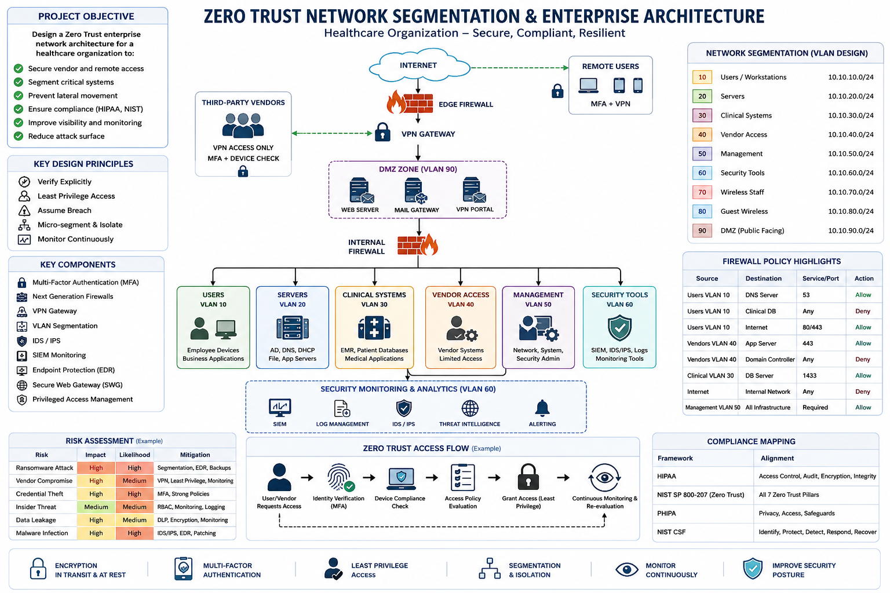
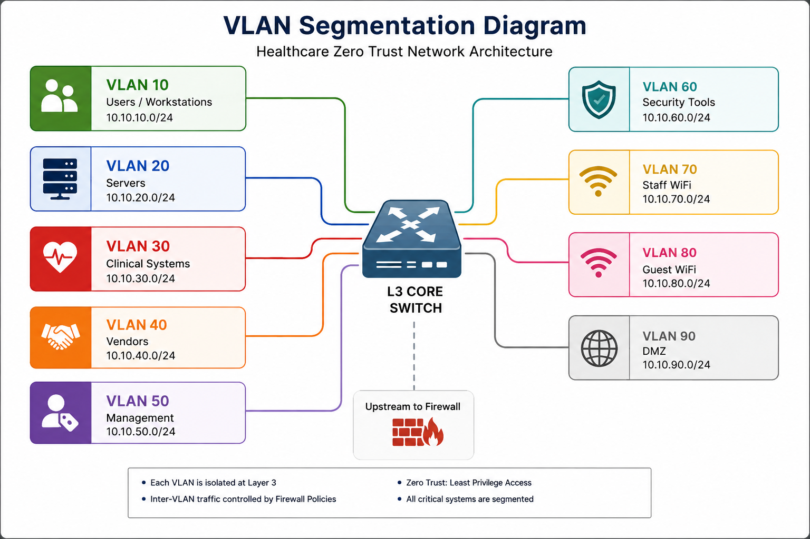
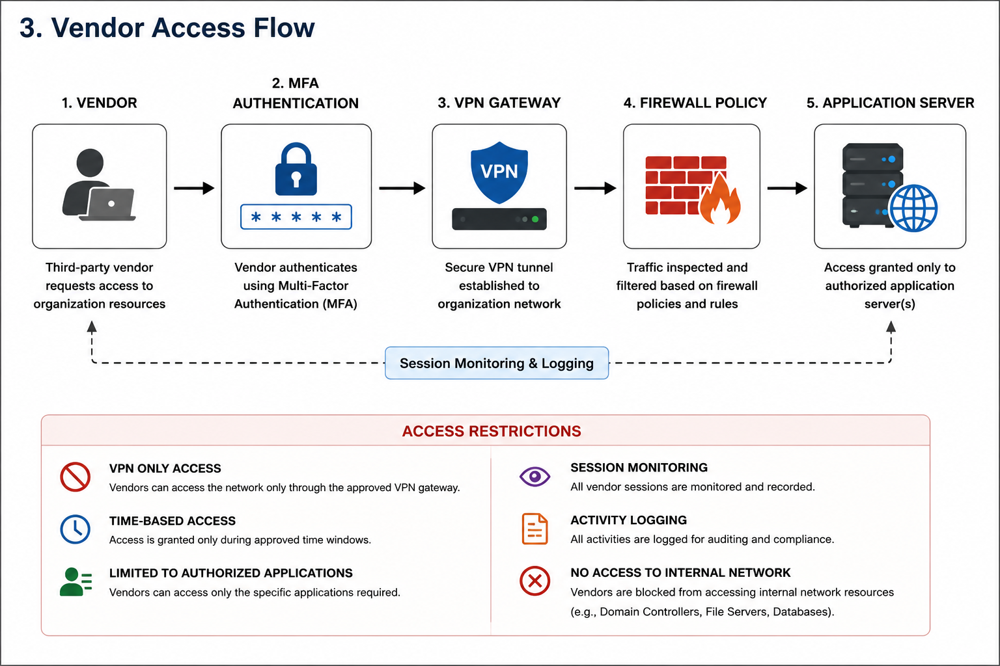
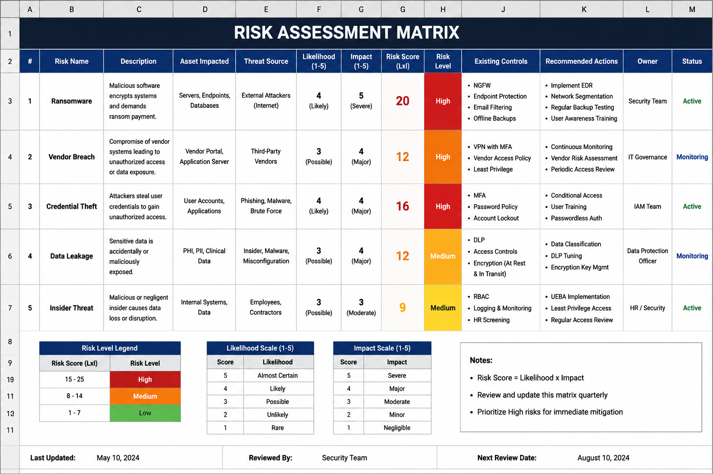
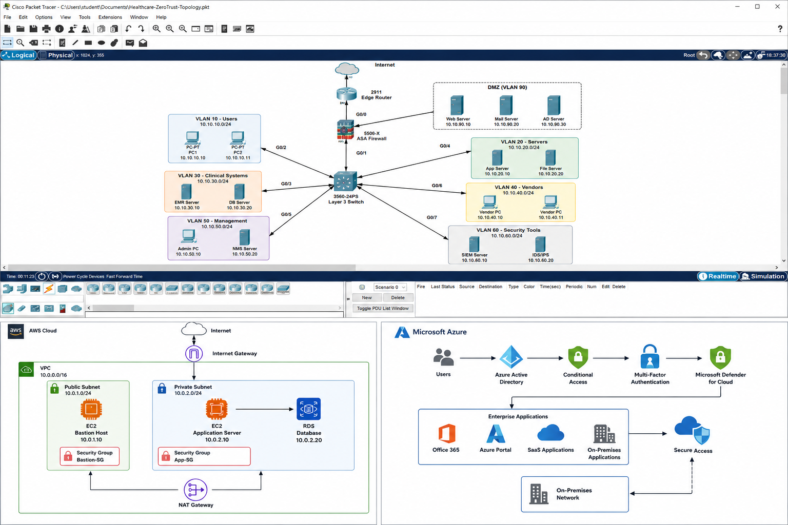

# Zero Trust Network Segmentation — Healthcare Enterprise Architecture

**Shiva Subedi** | Network Security • Zero Trust • Cisco • AWS • Azure • Risk Analysis

> Capstone security architecture for a 1,500-user healthcare organization, combining network segmentation, least-privilege access, vendor security, monitoring and cloud architecture.

## Project at a Glance

- Designed a Zero Trust architecture for a 1,500-user healthcare organization
- Implemented 9 VLAN security zones
- Designed vendor access controls using VPN and MFA
- Created firewall policy matrices using least privilege principles
- Integrated AWS and Azure security architectures
- Developed risk assessment and compliance mapping
- Built a Cisco Packet Tracer enterprise topology

---
## Business & Security Problem

Healthcare environments must support employees, clinical systems, servers, vendors, wireless users and internet-facing services without allowing unnecessary lateral access. This capstone designs a Zero Trust-oriented architecture that separates those trust zones and applies controlled access paths, monitoring and least-privilege principles.

The solution uses VLAN segmentation, firewall policy design, VPN + MFA vendor access, DMZ architecture, SIEM/IDS concepts, risk analysis and AWS/Azure security architecture.

---

## Enterprise Architecture

---

## VLAN Segmentation Design

---

## Vendor Access Flow

---

## Risk Assessment Matrix

---

## Packet Tracer, AWS and Azure Architecture

---

## Business Objectives

- Protect healthcare systems and patient information
- Secure third party vendor access
- Reduce attack surface
- Improve visibility and monitoring
- Support compliance requirements
- Enable secure remote connectivity

---

## Security Objectives

- Verify every user and device
- Enforce least privilege access
- Prevent lateral movement
- Monitor and log security events
- Segment critical systems
- Improve incident detection capabilities

---

## VLAN Structure

| VLAN | Purpose | Subnet |
|--------|----------|----------|
| 10 | Users | 10.10.10.0/24 |
| 20 | Servers | 10.10.20.0/24 |
| 30 | Clinical Systems | 10.10.30.0/24 |
| 40 | Vendors | 10.10.40.0/24 |
| 50 | Management | 10.10.50.0/24 |
| 60 | Security Tools | 10.10.60.0/24 |
| 70 | Staff Wireless | 10.10.70.0/24 |
| 80 | Guest Wireless | 10.10.80.0/24 |
| 90 | DMZ | 10.10.90.0/24 |

---

## Security Controls

### Identity Security
- Multi Factor Authentication (MFA)
- Azure Active Directory
- Active Directory
- Conditional Access

### Network Security
- VLAN Segmentation
- Internal Firewall Policies
- VPN Gateway
- DMZ Architecture

### Monitoring
- SIEM
- IDS/IPS
- Security Logging
- Threat Detection

### Access Management
- Role Based Access Control (RBAC)
- Least Privilege Access
- Vendor Access Restrictions

---

## Compliance Alignment

- NIST SP 800-207 Zero Trust Architecture
- NIST Cybersecurity Framework
- HIPAA Security Principles
- PHIPA Security Principles

---

## Technologies Used

### Networking
- Cisco Packet Tracer
- Cisco IOS
- VLANs
- Routing and Switching
- VPN Technologies

### Security
- Zero Trust Architecture
- Firewall Policy Design
- SIEM
- IDS/IPS
- MFA
- RBAC

### Cloud
- AWS VPC
- EC2
- RDS
- Azure Active Directory
- Microsoft Defender
- Conditional Access

### Systems Administration
- Windows Server
- Active Directory
- DNS
- DHCP

---

## Documentation

Project Report:

[Zero Trust Network Segmentation PDF](docs/Zero%20Trust%20Network%20Segmentation.pdf)

---

## Learning Outcomes

- Enterprise Network Architecture
- Zero Trust Security Design
- Network Segmentation
- Firewall Policy Development
- Vendor Access Management
- Risk Assessment
- Compliance Mapping
- Security Monitoring
- Cloud Security Architecture

---

## Portfolio Connections

- [Enterprise Windows Server & Active Directory Administration](https://github.com/shivasubedii/enterprise-windows-active-directory-lab)
- [Microsoft 365 | Entra ID | Intune Administration](https://github.com/shivasubedii/microsoft-365-entra-intune-enterprise-lab)
- [AutoSysAdmin — IT Systems Automation](https://github.com/shivasubedii/AutoSysAdmin)

## Interview Talking Points

I can explain the reasoning behind the nine security zones, how vendor access moves through MFA/VPN/firewall controls, how segmentation reduces lateral movement, how firewall policy should follow least privilege, and how monitoring and risk assessment support the architecture.

---
**Shiva Subedi** — Computer Systems Technology | Systems Administration | Networking | Cloud | Cybersecurity
